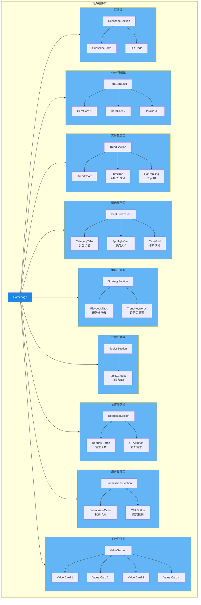
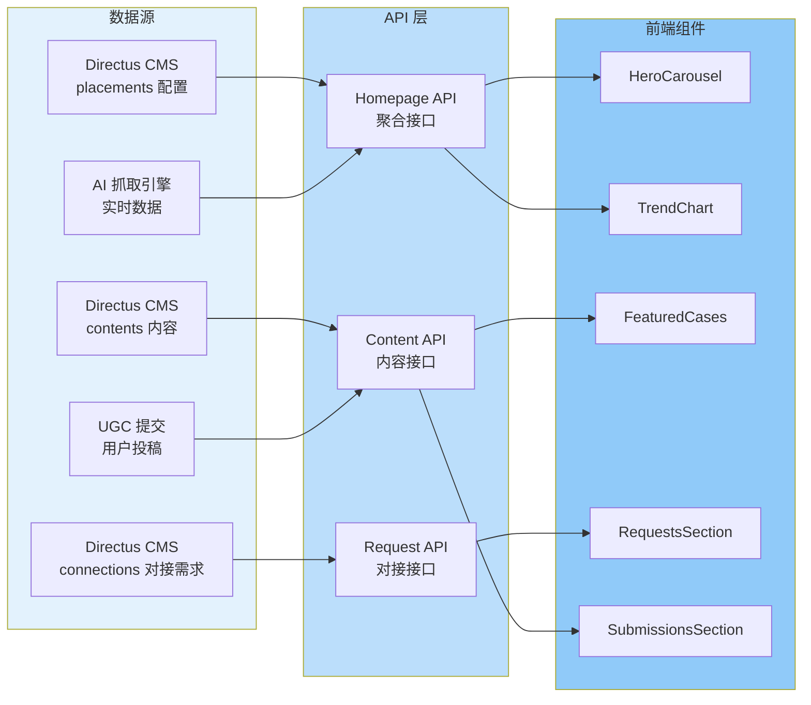
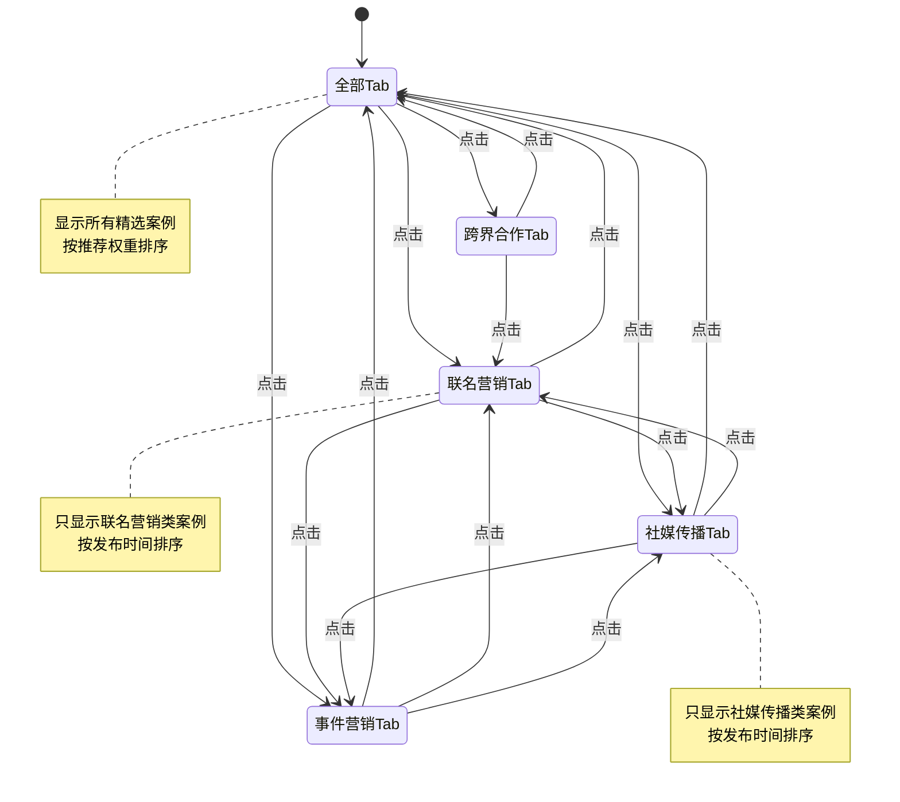
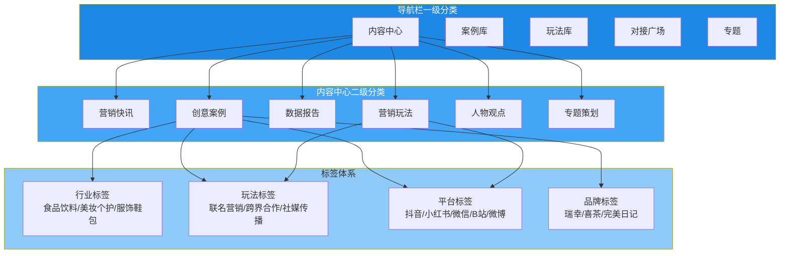
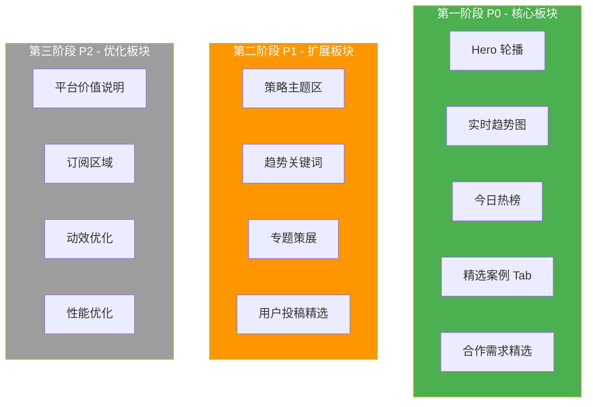
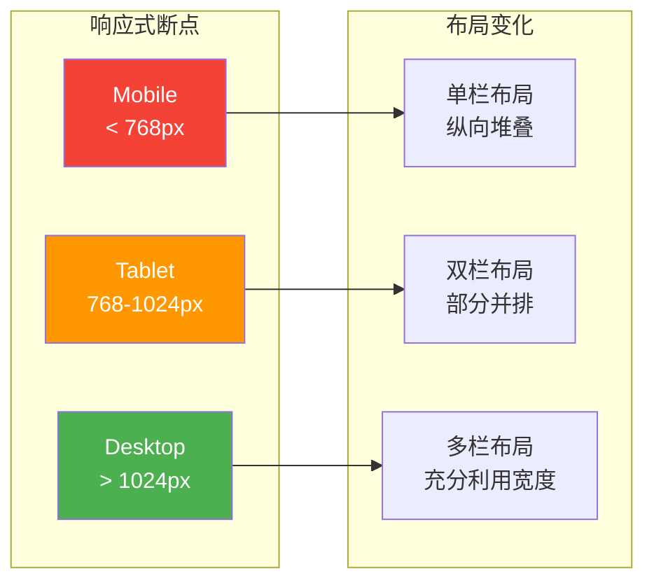
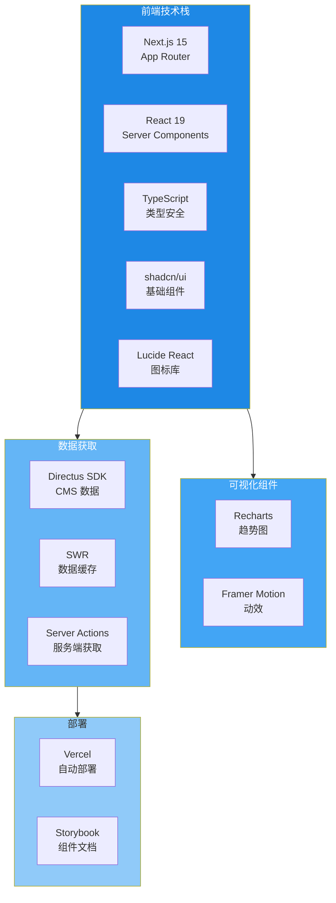
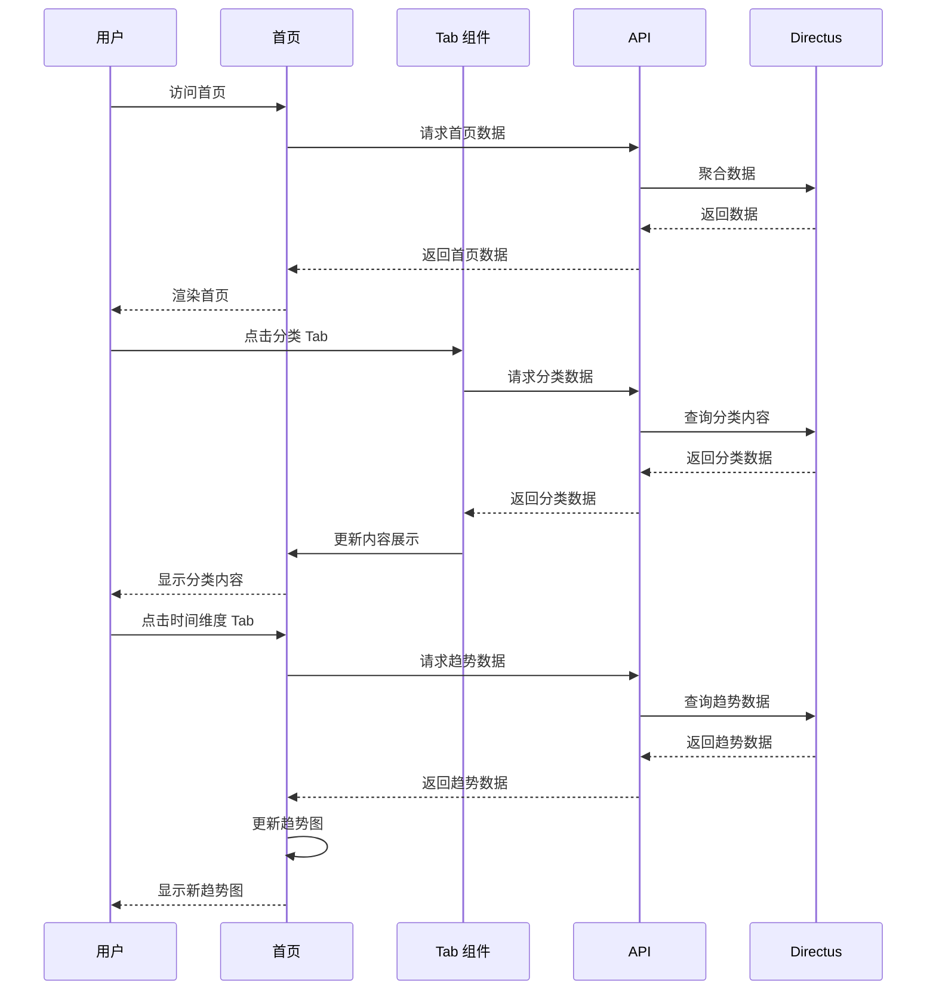

# QiuQiuTech 首页架构可视化图

## 1. 整体布局结构图

```mermaid
graph TB
    subgraph 首页布局
        A[顶部导航栏<br/>固定]
        B[Hero 轮播区<br/>可配置 3-5 张]
        C[实时趋势 + 今日热榜<br/>双栏布局]
        D[精选案例区<br/>Tab 分类切换]
        E[策略主题区<br/>玩法标签云 + 趋势关键词]
        F[专题策展区<br/>横向滚动]
        G[合作需求精选<br/>需求卡片 + CTA]
        H[用户投稿精选<br/>UGC 展示 + CTA]
        I[平台价值说明<br/>4 个价值点]
        J[订阅区域<br/>邮箱 + 二维码]
        K[页脚 Footer]
        
        A --> B
        B --> C
        C --> D
        D --> E
        E --> F
        F --> G
        G --> H
        H --> I
        I --> J
        J --> K
    end
    
    style A fill:#e3f2fd
    style B fill:#bbdefb
    style C fill:#90caf9
    style D fill:#64b5f6
    style E fill:#42a5f5
    style F fill:#2196f3
    style G fill:#1e88e5
    style H fill:#1976d2
    style I fill:#1565c0
    style J fill:#0d47a1
    style K fill:#0d47a1
```



## 2. 组件层次结构图



## 3. 数据流向图



## 4. Tab 切换交互状态图



## 5. 实时趋势时间维度切换图

```mermaid
graph LR
    subgraph TimeTabs[时间维度 Tab]
        T24[24h<br/>默认]
        T7[7d]
        T30[30d]
    end
    
    subgraph Data[数据聚合]
        D24[最近 24 小时数据]
        D7[最近 7 天数据]
        D30[最近 30 天数据]
    end
    
    subgraph Chart[趋势图]
        C1[趋势线 1<br/>品牌联名]
        C2[趋势线 2<br/>社媒传播]
        C3[趋势线 3<br/>事件营销]
    end
    
    T24 --> D24: 点击
    T7 --> D7: 点击
    T30 --> D30: 点击
    
    D24 --> C1
    D24 --> C2
    D24 --> C3
    
    D7 --> C1
    D7 --> C2
    D7 --> C3
    
    D30 --> C1
    D30 --> C2
    D30 --> C3
    
    style T24 fill:#2196f3,color:#fff
    style T7 fill:#e3f2fd
    style T30 fill:#e3f2fd
```

## 6. 内容分类体系图



## 7. 配置优先级图



## 8. 响应式布局断点图



## 9. 技术栈架构图



## 10. 用户交互流程图


